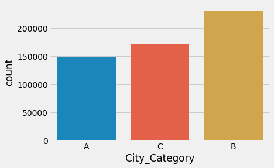

# Introduction

Black Friday is an informal name for the Friday following Thanksgiving Day in the United States, which is celebrated on the fourth Thursday of November. The day after Thanksgiving has been regarded as the beginning of America's Christmas shopping season since 1952, although the term "Black Friday" didn't become widely used until more recent decades.

Many stores offer highly promoted sales on Black Friday and open very early, such as at midnight, or may even start their sales at some time on Thanksgiving. Black Friday is not an official holiday, but California and some other states observe "The Day After Thanksgiving" as a holiday for state government employees, sometimes in lieu of another federal holiday, such as Columbus Day. Many non-retail employees and schools have both Thanksgiving and the following Friday off, which, along with the following regular weekend, makes it a four-day weekend, thereby increasing the number of potential shoppers.

Black Friday has routinely been the busiest shopping day of the year in the United States since 2005, although news reports, which at that time were inaccurate, have described it as the busiest shopping day of the year for a much longer period of time. Similar stories resurface year upon year at this time, portraying hysteria and shortage of stock, creating a state of positive feedback.

In 2014, spending volume on Black Friday fell for the first time since the 2008 recession. $50.9$ billion was spent during the 4-day Black Friday weekend, down $11%$ from the previous year. However, the U.S. economy was not in a recession. Christmas creep has been cited as a factor in the diminishing importance of Black Friday, as many retailers now spread out their promotions over the entire months of November and December rather than concentrate them on a single shopping day or weekend.

The earliest evidence of the phrase Black Friday applied to the day after Thanksgiving in a shopping context suggests that the term originated in Philadelphia, where it was used to describe the heavy and disruptive pedestrian and vehicle traffic that would occur on the day after Thanksgiving. This usage dates to at least 1961. More than twenty years later, as the phrase became more widespread, a popular explanation became that this day represented the point in the year when retailers begin to turn a profit, thus going from being "in the red" to being "in the black".

For many years, it was common for retailers to open at 6:00 a.m., but in the late 2000s many had crept to 5:00 or 4:00. This was taken to a new extreme in 2011, when several retailers (including Target, Kohl's, Macy's, Best Buy, and Bealls) opened at midnight for the first time. In 2012, Walmart and several other retailers announced that they would open most of their stores at 8:00 p.m. on Thanksgiving Day, prompting calls for a walkout among some workers. In 2014, stores such as JCPenney, Best Buy, and Radio Shack opened at 5:00 PM on Thanksgiving Day while stores such as Target, Walmart, Belk, and Sears opened at 6:00 PM on Thanksgiving Day. Three states, Rhode Island, Maine, and Massachusetts, prohibit large supermarkets, big box stores, and department stores from opening on Thanksgiving, due to what critics refer to as blue laws. The Massachusetts ban on forcing employees to work on major holidays is not a religion-driven "blue law" but part of the state's Common Day of Rest Law. A bill to allow stores to open on Thanksgiving Day was the subject of a public hearing on July 8, 2017.

# Study Objective

A retail company “ABC Private Limited” wants to understand their customer purchase behaviour (specifically, purchase amount) against various products of different categories. They have shared purchase summary of various customers for selected high volume products from last month. The data set also contains customer demographics (age, gender, marital status, city_type, stay_in_current_city), product details (product_id and product category) and Total purchase_amount from last month. Now, We are going to analyze the customer behaviour using visualization and build a model to predict the purchase amount of customer against various products which will help them to create personalized offer for customers against different products.

Objective of this study is checking efficiency of various machine learning algorithm on one of open source data avilable. We have taken **Black Friday Sales** data from one of most data science learing website [analytics vidhya](https://www.analyticsvidhya.com/).This data consists below variables:

**Dependant variable(Y):** Purchase

**Independent variables(X):**

 1. User_ID : Unique id of each customer who made purchase
 2. Product_ID : Unique id of product purchased by customer
 3. Gender : Sex of User
 4. Age : Age in category of each customer
 5. Occupation : Occupation of each customer(Masked in data)
 6. City_Category : Category of the City (A,B,C)
 7. Stay_In_Current_City_Years : Number of years stay by customer in current city
 8. Marital_Status : Marital Status of customer
 10. Product_Category_1 : Product Category (Masked)
 11. Product_Category_2 : Product may belongs to other category also (Masked)
 12. Product_Category_3 : Product may belongs to other category also (Masked)


# Methodology

## Framing the problem statement

Before looking at the data it is important to understand how does the company expect to use and benefit from this model? This first brainstorming helps to determine how to frame the problem, what algorithms to select and measure the performance of each one.

We can categorize our Machine Learning (ML) system as:

**Supervised Learning task:** we are given labeled training data (e.g. we already know how much a customer spent on a specific product);

**Regression task:** our algorithm is expected to predict the purchase amount a client is expected to spend on this day.

## Select a Performance Measure

Usually for regression problems the typical performance measure is the `Root Mean Square Error (RMSE)`. This function gives an idea of how much error the system makes in its predictions with higher weight for large errors. RMSE is calculated as:

$$ RMSE = \sqrt{\frac{1}{n}\sum_{i=1}^{n}(y_{i} - \hat{y_i})^2}$$

Where $\hat{y_i}$ is the predicted value and $y_{i}$ is the original value.

## Make Assumptions

Before even looking at the available data is good to make some assumption on the expected results. Therefore, let’s start to think about possible parameters that might influence the amount a client spends on Black Friday.We can divide the different factors into four levels : City Level, Store Level, Product Level and Customer Level.

**City Level Hypotheses:**

 1. City Type : Urban or Tier 1 cities should have higher sales because of the higher income levels of people there.
 2. Population Density: Cities with densely populated areas should have higher sales because of more demand.
 3. Younger Population : Cities with younger populations might have higher tendency to spend more on Black Friday

**Customer Level Hypotheses:**

 1. Income: People with higher income should spend more on products.
 2. Age and Gender: Men with ages ranging from 25 to 40 should spend more on techlogical products.
 3. Family Size: Families should be more contained on spendings, just buying the best offers and only needed products.
 4. Purchase History: Customer with a purchase history should be more willing to purchase more products on this day.

**Store Level Hypotheses:**

 1. Location: Stores with a location in well moved streets should have better sales.
 2. Size: Bigger stores with higher stores and variety of products should have better sales.
 3. Competition: Stores with no competitors near by must have the highest sales.
 4. Marketing: Do stores which spend more on marketing should have the best sales results

**Product Level Hypotheses:**

 1. Category: Most clients should be looking to buy technological products;
 2. Price: Customer will spend more on products with higher discounts
 3. Advertising: More advertised products should sell more
 4. Visibility: More visible products should sell more
 5. Brand: Clients will invest more on already known brands

**Organisation of our analysis**

Our goal as a Data Scientist is to identify the most important variables and to define the best regression model for predicting out target variable. Hence, this analysis will be divided into five stages:

 + Setting the environment
 + Exploratory data analysis(EDA)
 + Data Pre-processing
 + Feature engineering
 + Feature Transformation
 + Building various  machine learning models
 + Ensembling
 + Conclusion
 

# Setting the environment

Let’s start by importing some libraries and our data.

## Setting the path and libraries


```python
# setting the path
import os
os.chdir("D:/A Notes by 1st sem MSc(Nitesh)/Project/Blackfriday")

# importing libraries
import pandas as pd # For data manipulation
import numpy as np # For numerical analysis
import seaborn as sns # For visulization
import matplotlib.pyplot as plt # For visulization
#To visualize the whole grid
pd.options.display.max_columns = 999
```

## Importing Data

Lets start by loading our data set.


```python
train = pd.read_csv("train.csv")
test = pd.read_csv("test.csv")
```

## Understanding the data

Let's understand our dataset. At first, let's look at first few observation.


```python
train.head()
```


<div>
<style scoped>
    .dataframe tbody tr th:only-of-type {
        vertical-align: middle;
    }

    .dataframe tbody tr th {
        vertical-align: top;
    }

    .dataframe thead th {
        text-align: right;
    }
</style>
<table border="1" class="dataframe">
  <thead>
    <tr style="text-align: right;">
      <th></th>
      <th>User_ID</th>
      <th>Product_ID</th>
      <th>Gender</th>
      <th>Age</th>
      <th>Occupation</th>
      <th>City_Category</th>
      <th>Stay_In_Current_City_Years</th>
      <th>Marital_Status</th>
      <th>Product_Category_1</th>
      <th>Product_Category_2</th>
      <th>Product_Category_3</th>
      <th>Purchase</th>
    </tr>
  </thead>
  <tbody>
    <tr>
      <th>0</th>
      <td>1000001</td>
      <td>P00069042</td>
      <td>F</td>
      <td>0-17</td>
      <td>10</td>
      <td>A</td>
      <td>2</td>
      <td>0</td>
      <td>3</td>
      <td>NaN</td>
      <td>NaN</td>
      <td>8370</td>
    </tr>
    <tr>
      <th>1</th>
      <td>1000001</td>
      <td>P00248942</td>
      <td>F</td>
      <td>0-17</td>
      <td>10</td>
      <td>A</td>
      <td>2</td>
      <td>0</td>
      <td>1</td>
      <td>6.0</td>
      <td>14.0</td>
      <td>15200</td>
    </tr>
    <tr>
      <th>2</th>
      <td>1000001</td>
      <td>P00087842</td>
      <td>F</td>
      <td>0-17</td>
      <td>10</td>
      <td>A</td>
      <td>2</td>
      <td>0</td>
      <td>12</td>
      <td>NaN</td>
      <td>NaN</td>
      <td>1422</td>
    </tr>
    <tr>
      <th>3</th>
      <td>1000001</td>
      <td>P00085442</td>
      <td>F</td>
      <td>0-17</td>
      <td>10</td>
      <td>A</td>
      <td>2</td>
      <td>0</td>
      <td>12</td>
      <td>14.0</td>
      <td>NaN</td>
      <td>1057</td>
    </tr>
    <tr>
      <th>4</th>
      <td>1000002</td>
      <td>P00285442</td>
      <td>M</td>
      <td>55+</td>
      <td>16</td>
      <td>C</td>
      <td>4+</td>
      <td>0</td>
      <td>8</td>
      <td>NaN</td>
      <td>NaN</td>
      <td>7969</td>
    </tr>
  </tbody>
</table>
</div>


```python
test.head()
```


<div>
<style scoped>
    .dataframe tbody tr th:only-of-type {
        vertical-align: middle;
    }

    .dataframe tbody tr th {
        vertical-align: top;
    }

    .dataframe thead th {
        text-align: right;
    }
</style>
<table border="1" class="dataframe">
  <thead>
    <tr style="text-align: right;">
      <th></th>
      <th>User_ID</th>
      <th>Product_ID</th>
      <th>Gender</th>
      <th>Age</th>
      <th>Occupation</th>
      <th>City_Category</th>
      <th>Stay_In_Current_City_Years</th>
      <th>Marital_Status</th>
      <th>Product_Category_1</th>
      <th>Product_Category_2</th>
      <th>Product_Category_3</th>
    </tr>
  </thead>
  <tbody>
    <tr>
      <th>0</th>
      <td>1000004</td>
      <td>P00128942</td>
      <td>M</td>
      <td>46-50</td>
      <td>7</td>
      <td>B</td>
      <td>2</td>
      <td>1</td>
      <td>1</td>
      <td>11.0</td>
      <td>NaN</td>
    </tr>
    <tr>
      <th>1</th>
      <td>1000009</td>
      <td>P00113442</td>
      <td>M</td>
      <td>26-35</td>
      <td>17</td>
      <td>C</td>
      <td>0</td>
      <td>0</td>
      <td>3</td>
      <td>5.0</td>
      <td>NaN</td>
    </tr>
    <tr>
      <th>2</th>
      <td>1000010</td>
      <td>P00288442</td>
      <td>F</td>
      <td>36-45</td>
      <td>1</td>
      <td>B</td>
      <td>4+</td>
      <td>1</td>
      <td>5</td>
      <td>14.0</td>
      <td>NaN</td>
    </tr>
    <tr>
      <th>3</th>
      <td>1000010</td>
      <td>P00145342</td>
      <td>F</td>
      <td>36-45</td>
      <td>1</td>
      <td>B</td>
      <td>4+</td>
      <td>1</td>
      <td>4</td>
      <td>9.0</td>
      <td>NaN</td>
    </tr>
    <tr>
      <th>4</th>
      <td>1000011</td>
      <td>P00053842</td>
      <td>F</td>
      <td>26-35</td>
      <td>1</td>
      <td>C</td>
      <td>1</td>
      <td>0</td>
      <td>4</td>
      <td>5.0</td>
      <td>12.0</td>
    </tr>
  </tbody>
</table>
</div>


```python
train.info()
```

    <class 'pandas.core.frame.DataFrame'>
    RangeIndex: 550068 entries, 0 to 550067
    Data columns (total 12 columns):
    User_ID                       550068 non-null int64
    Product_ID                    550068 non-null object
    Gender                        550068 non-null object
    Age                           550068 non-null object
    Occupation                    550068 non-null int64
    City_Category                 550068 non-null object
    Stay_In_Current_City_Years    550068 non-null object
    Marital_Status                550068 non-null int64
    Product_Category_1            550068 non-null int64
    Product_Category_2            376430 non-null float64
    Product_Category_3            166821 non-null float64
    Purchase                      550068 non-null int64
    dtypes: float64(2), int64(5), object(5)
    memory usage: 50.4+ MB
    


```python
test.info()
```

    <class 'pandas.core.frame.DataFrame'>
    RangeIndex: 233599 entries, 0 to 233598
    Data columns (total 11 columns):
    User_ID                       233599 non-null int64
    Product_ID                    233599 non-null object
    Gender                        233599 non-null object
    Age                           233599 non-null object
    Occupation                    233599 non-null int64
    City_Category                 233599 non-null object
    Stay_In_Current_City_Years    233599 non-null object
    Marital_Status                233599 non-null int64
    Product_Category_1            233599 non-null int64
    Product_Category_2            161255 non-null float64
    Product_Category_3            71037 non-null float64
    dtypes: float64(2), int64(4), object(5)
    memory usage: 19.6+ MB
    

**Findings:**

 + Train data are 550068 observation and 12 variables.
 + Product_Category_2 are 376430 observation in train data.
 + Product_Category_3 are 166821 observation in train data.
 + Test data are 233599 observation and 11 variables.
 + Product_Category_2 are 161255 observation in test data.
 + Product_Category_3 are 71037 observation in test data.

# Exploratory Data Analysis (EDA)

We’ve made our first assumptions on the data and now we are ready to perform some basic data exploration and come up with some inference. Hence, the goal for this section is to take a glimpse on the data as well as any irregularities so that we can correct on the next section, Data Pre-Processing.


## Descriptive Statistics


```python
train.describe()
```


<div>
<style scoped>
    .dataframe tbody tr th:only-of-type {
        vertical-align: middle;
    }

    .dataframe tbody tr th {
        vertical-align: top;
    }

    .dataframe thead th {
        text-align: right;
    }
</style>
<table border="1" class="dataframe">
  <thead>
    <tr style="text-align: right;">
      <th></th>
      <th>User_ID</th>
      <th>Occupation</th>
      <th>Marital_Status</th>
      <th>Product_Category_1</th>
      <th>Product_Category_2</th>
      <th>Product_Category_3</th>
      <th>Purchase</th>
    </tr>
  </thead>
  <tbody>
    <tr>
      <th>count</th>
      <td>5.500680e+05</td>
      <td>550068.000000</td>
      <td>550068.000000</td>
      <td>550068.000000</td>
      <td>376430.000000</td>
      <td>166821.000000</td>
      <td>550068.000000</td>
    </tr>
    <tr>
      <th>mean</th>
      <td>1.003029e+06</td>
      <td>8.076707</td>
      <td>0.409653</td>
      <td>5.404270</td>
      <td>9.842329</td>
      <td>12.668243</td>
      <td>9263.968713</td>
    </tr>
    <tr>
      <th>std</th>
      <td>1.727592e+03</td>
      <td>6.522660</td>
      <td>0.491770</td>
      <td>3.936211</td>
      <td>5.086590</td>
      <td>4.125338</td>
      <td>5023.065394</td>
    </tr>
    <tr>
      <th>min</th>
      <td>1.000001e+06</td>
      <td>0.000000</td>
      <td>0.000000</td>
      <td>1.000000</td>
      <td>2.000000</td>
      <td>3.000000</td>
      <td>12.000000</td>
    </tr>
    <tr>
      <th>25%</th>
      <td>1.001516e+06</td>
      <td>2.000000</td>
      <td>0.000000</td>
      <td>1.000000</td>
      <td>5.000000</td>
      <td>9.000000</td>
      <td>5823.000000</td>
    </tr>
    <tr>
      <th>50%</th>
      <td>1.003077e+06</td>
      <td>7.000000</td>
      <td>0.000000</td>
      <td>5.000000</td>
      <td>9.000000</td>
      <td>14.000000</td>
      <td>8047.000000</td>
    </tr>
    <tr>
      <th>75%</th>
      <td>1.004478e+06</td>
      <td>14.000000</td>
      <td>1.000000</td>
      <td>8.000000</td>
      <td>15.000000</td>
      <td>16.000000</td>
      <td>12054.000000</td>
    </tr>
    <tr>
      <th>max</th>
      <td>1.006040e+06</td>
      <td>20.000000</td>
      <td>1.000000</td>
      <td>20.000000</td>
      <td>18.000000</td>
      <td>18.000000</td>
      <td>23961.000000</td>
    </tr>
  </tbody>
</table>
</div>


**Findings:**

 + Average of purchase spend in product of $9263.968713.
 
 + Max of purchase spend in product of $23961 and Min of purchase spend in product of $12.


```python
# Check for duplicates
idsUnique = len(set(train.User_ID))
idsTotal = train.shape[0]
idsDupli = idsTotal - idsUnique
print("There are " + str(idsDupli) + " duplicate IDs for " + str(idsTotal) + " total entries")
```

    There are 544177 duplicate IDs for 550068 total entries
    

Age : should be treated as numerical. It presents age groups.

City_Category: We can convert this to numerical as well, with dummy variables. Should take a look at the frequency of the values.

Occupation : It seems like it has at least 16 different values, should see frequency and try to decrease this value.

Gender: There are possibly two gender, we can make this binary.

Product_ID: Should see if the string “P” means something and if there are other values.

Stay_In_Current_City_Years: We should deal with the ‘+’ symbol.

Product_Category_2 and Product_Category_3 : Have NaN values.

New variables to have in consideration:

User_Count : There are duplicate User_ID , so it would be a good idea to create a feature with number of observations of the user.

Product_Count : Number of observations of the product.


## Univariate Distribution

To get an idea of the distribution of numerical variables, histograms are an excellent starting point. Let’s begin by generating one for Purchase, our target variable.

###  Distribution of the target variable : Purchase


```python
plt.style.use('fivethirtyeight')
plt.figure(figsize=(12,7))
sns.distplot(train.Purchase, bins = 25)
plt.xlabel("Amount spent in Purchase")
plt.ylabel("Number of Buyers")
plt.title("Purchase amount Distribution")
plt.show();
```

    C:\ProgramData\Anaconda3\lib\site-packages\scipy\stats\stats.py:1713: FutureWarning: Using a non-tuple sequence for multidimensional indexing is deprecated; use `arr[tuple(seq)]` instead of `arr[seq]`. In the future this will be interpreted as an array index, `arr[np.array(seq)]`, which will result either in an error or a different result.
      return np.add.reduce(sorted[indexer] * weights, axis=axis) / sumval
    


```python
print ("Skew is:", train.Purchase.skew())
print("Kurtosis: %f" % train.Purchase.kurt())
```

    Skew is: 0.6001400037087128
    Kurtosis: -0.338378
    

**Findings:**

It seems like our target variable has an almost Gaussian distribution.
It looks like Purchase is somewhat following normal distribution, slightly skewed to the right sides.

### Numerical Variables

Now that we’ve analysed our target variable, let’s consider our predictors. Let’s start by seeing which of our features are numeric.


```python
numeric_features = train.select_dtypes(include=[np.number])
numeric_features.dtypes
```


    User_ID                 int64
    Occupation              int64
    Marital_Status          int64
    Product_Category_1      int64
    Product_Category_2    float64
    Product_Category_3    float64
    Purchase                int64
    dtype: object


#### Distribution of the Occupation variable

As seen in the beginning, Occupation has at least 20 different values. Since we do not known to each occupation each number corresponds, is difficult to make any analysis. Furthermore, it seems we have no alternative but to use since there is no way to reduce this number as we did on Project Bigmart with Item_Type.


```python
train.Occupation.value_counts()
```


    4     72308
    0     69638
    7     59133
    1     47426
    17    40043
    20    33562
    12    31179
    14    27309
    2     26588
    16    25371
    6     20355
    3     17650
    10    12930
    5     12177
    15    12165
    11    11586
    19     8461
    13     7728
    18     6622
    9      6291
    8      1546
    Name: Occupation, dtype: int64


```python
sns.countplot(train.Occupation);
```


**Finding:**

 + There are 21 unique Occupation availble in train data.
 + More purchasing in customers of Occupation 4,0 and 8.


#### Distribution of the Marital_Status variable

As expected there are more single people buying products on Black Friday than married people, but do they spend more?


```python
train.Marital_Status.value_counts()
```


    0    324731
    1    225337
    Name: Marital_Status, dtype: int64


```python
sns.countplot(train.Marital_Status);
```


**Finding:**

 + There are 2 unique Marital_Status availble in train data.
 + Out of 550068 observation in train data, 59% purchase made by Not Married are Marital_Status of purchase of 324731 customers, 41% purchase made by Married are Marital_Status of purchase of 225337 customers.
 + More purchase of customers in Marital_Status are Not Married customers.

#### Distribution of the Product_Category_1 variable

From the distribution for products from category one, it is clear that three products stand out, number 1, 5 and 8. Unfortunately, we do not know which product each number represents.


```python
train.Product_Category_1.value_counts()
```


    5     150933
    1     140378
    8     113925
    11     24287
    2      23864
    6      20466
    3      20213
    4      11753
    16      9828
    15      6290
    13      5549
    10      5125
    12      3947
    7       3721
    18      3125
    20      2550
    19      1603
    14      1523
    17       578
    9        410
    Name: Product_Category_1, dtype: int64


```python
sns.countplot(train.Product_Category_1);
```


**Finding:**

 + There are 20 unique Product_Category_1 availble in train data.
 + More purchase of customers in Product_Category_1 are Product 5,Product 1 and Product 8.Total sell count of Product 5 are 150933, total sell count of product 1 are 140378 and total sell count of product 8 are 113925.


#### Distribution of the Product_Category_2 variable


```python
train.Product_Category_2.value_counts()
```


    8.0     64088
    14.0    55108
    2.0     49217
    16.0    43255
    15.0    37855
    5.0     26235
    4.0     25677
    6.0     16466
    11.0    14134
    17.0    13320
    13.0    10531
    9.0      5693
    12.0     5528
    10.0     3043
    3.0      2884
    18.0     2770
    7.0       626
    Name: Product_Category_2, dtype: int64


```python
sns.countplot(train.Product_Category_2);
plt.xticks(rotation=90);
```


**Finding:**

 + There are 18 unique Product_Category_2 availble in train data.
 + More purchase of customers in Product_Category_2 are Product 8,Product 14 and Product 2.Total sell count of Product 8 are 64088, total sell count of product 14 are 55108 and total sell count of product 2 are 49217.

#### Distribution of the Product_Category_3 variable


```python
train.Product_Category_3.value_counts()
```


    16.0    32636
    15.0    28013
    14.0    18428
    17.0    16702
    5.0     16658
    8.0     12562
    9.0     11579
    12.0     9246
    13.0     5459
    6.0      4890
    18.0     4629
    4.0      1875
    11.0     1805
    10.0     1726
    3.0       613
    Name: Product_Category_3, dtype: int64


```python
sns.countplot(train.Product_Category_3);
plt.xticks(rotation=90);
```


**Finding:**

 + There are 16 unique Product_Category_3 availble in train data.
 + More purchase of customers in Product_Category_3 are Product 16,Product 15 and Product 14.Total sell count of Product 16 are 32636, total sell count of product 15 are 28013 and total sell count of product 14 are 18428.

#### Correlation between Numerical Predictors and Target variable


```python
corr = numeric_features.corr()

print (corr['Purchase'].sort_values(ascending=False)[:10])
```

    Purchase              1.000000
    Occupation            0.020833
    User_ID               0.004716
    Marital_Status       -0.000463
    Product_Category_3   -0.022006
    Product_Category_2   -0.209918
    Product_Category_1   -0.343703
    Name: Purchase, dtype: float64
    

There does not seem to be any predictor that would have a high impact on Purchase , since the highest positive correlation is give by Occupation with 0.0208. On the other hand, Product_Category_1 has a negative correlation with our target with the value -0.3437 which is somehow odd.


```python
#correlation matrix
f, ax = plt.subplots(figsize=(20, 9))
sns.heatmap(corr, vmax=.8,annot_kws={'size': 20}, annot=True);
```


There seems to be no multicollinearity with our predictors which is a good thing, although there is some correlation among the product categories. Are category 2 and 3 necessary? Can we dispose them?

### Categorical Variables

For categorical variables, bar charts and frequency counts are the natural counterparts to histograms. Now is time to look at the variables that contain some insight on the assumptions previously made.

#### Distribution of the variable Gender

Most of the buyers are males, but who spends more on each purchase: man or woman?


```python
sns.countplot(train.Gender);
```


**Finding:**

 + There are 2 Gender(Male/Female) availble in train data.
 + Out of 550068 observation in train data, 75.3% purchase made by Male customers and rest 24.7% purchase made by Female.

#### Distribution of the variable Age


```python
sns.countplot(train.Age);
```


**Finding:**

 + There are 7 Age category(0-17/18-25/26-35/36-45/46-50/51-55/55+) availble in train data.
 + Out of 550068 observation in train data, 39.9% purchase made by 26-35 Age of purchase of 219587 customers, 20% purchase made by 36-45 Age of purchase of 110013 customers, 18.1% purchase made by 18-25 Age of purchase of 99660 customers, 8.31% purchase made by 46-50 Age of purchase of 45701 customers, 7% purchase made by 51-55 Age of purchase of 38501 customers, 3.91% purchase made by 55+ Age of purchase of 21504 customers, and 2.75% purchase made by 0-17 Age of purchase of 15102 customers.

#### Distribution of the variable City_Category

Supposing ‘A’ represents the biggest city whereas ‘C’ the smallest, it curious to see that the medium size cities ‘B’ had higher sales than the others. But do they also spent more?


```python
sns.countplot(train.City_Category);
```





**Finding:**

 + There are 3 unique City_Category(A,B and C) availble in train data.
 + Out of 550068 observation in train data, 42% purchase made by B City_Category of purchase of 231173 customers, 31.1% purchase made by C City_Category of purchase of 171175 customers, 26.9% purchase made by A City_Category of purchase of 147729 customers.
 + More purchase of customers in City_category B.

#### Distribution of the variable Stay_In_Current_City_Years

The tendency looks like the longest someone is living in that city the less prone they are to buy new things. Hence, if someone is new in town and needs a great number of new things for their house that they’ll take advantage of the low prices in Black Friday to purchase all the things needed.


```python
sns.countplot(train.Stay_In_Current_City_Years);
```


**Finding:**

 + There are 5 unique Stay_In_Current_City_Years availble in train data.
 + Out of 550068 observation in train data, 35.2% purchase made by 1 years are Stay_In_Current_City_Years of purchase of 193821 customers, 18.5% purchase made by 2 years are Stay_In_Current_City_Years of purchase of 101838 customers, 17.3% purchase made by 3 years are Stay_In_Current_City_Years of purchase of 95285 customers, 15.4% purchase made by 4+ years are Stay_In_Current_City_Years of purchase of 84726 customers, and 13.5% purchase made by 0 years are Stay_In_Current_City_Years of purchase of 74398 customers.
 + More purchase of customers in Stay_In_Current_City 1 years.

## Bivariate Distribution

Firstly we individually analysed some of the existent features, now it is time to understand the relationship between our target variable and predictors as well as the relationship among predictors.


### Numerical Variables

#### Occupation and Purchase Analysis

Although there are some occupations which have higher representations, it seems that the amount each user spends on average is more or less the same for all occupations. Of course, in the end, occupations with the highest representations will have the highest amounts of purchases.


```python
Occupation_pivot = \
train.pivot_table(index='Occupation', values="Purchase", aggfunc=np.mean)

Occupation_pivot.plot(kind='bar', color='pink',figsize=(12,7))
plt.xlabel("Occupation")
plt.ylabel("Purchase")
plt.title("Occupation and Purchase Analysis")
plt.xticks(rotation=0)
plt.show()

```


#### Marital_Status and Purchase Analysis

Now, this is a interesting aspect. We had more single customers than married. However, on average an individual customer tends to spend the same amount independently if his/her is married or not. Again, if you had all the purchases the single group, since has a higher representation, will have the highest purchase values.


```python
Marital_Status_pivot = \
train.pivot_table(index='Marital_Status', values="Purchase", aggfunc=np.mean)

Marital_Status_pivot.plot(kind='bar', color='pink',figsize=(12,7))
plt.xlabel("Marital_Status")
plt.ylabel("Purchase")
plt.title("Marital_Status and Purchase Analysis")
plt.xticks(rotation=0)
plt.show()
```


##### Product_Category_1 and Purchase Analysis

If you see the value spent on average for Product_Category_1 you see that although there were more products bought for categories 1,5,8 the average amount spent for those three is not the highest. It is interesting to see other categories appearing with high purchase values despite having low impact on sales number.


```python
Product_category_1_pivot = \
train.pivot_table(index='Product_Category_1', values="Purchase", aggfunc=np.mean)

Product_category_1_pivot.plot(kind='bar', color='pink',figsize=(12,7))
plt.xlabel("Product_Category_1")
plt.ylabel("Purchase")
plt.title("Product_Category_1 and Purchase Analysis")
plt.xticks(rotation=0)
plt.show()
```


```python
Product_category_1_pivot = \
train.pivot_table(index='Product_Category_1', values="Purchase", aggfunc=np.sum)

Product_category_1_pivot.plot(kind='bar', color='pink',figsize=(12,7))
plt.xlabel("Product_Category_1")
plt.ylabel("Purchase")
plt.title("Product_Category_1 and Purchase Analysis")
plt.xticks(rotation=0)
plt.show()
```


#### Product_Category_2 and Purchase Analysis


```python
Product_category_1_pivot = \
train.pivot_table(index='Product_Category_2', values="Purchase", aggfunc=np.sum)

Product_category_1_pivot.plot(kind='bar', color='pink',figsize=(12,7))
plt.xlabel("Product_Category_2")
plt.ylabel("Purchase")
plt.title("Product_Category_2 and Purchase Analysis")
plt.xticks(rotation=0)
plt.show()
```


For examples, if instead of the average spent we look at the amount spent on purchase, as illustrated in the chart below, that distribution that we saw for this predictor previously appears here. For example, those three products have the highest sum of sales since their were three most sold products.


```python
Product_category_1_pivot = \
train.pivot_table(index='Product_Category_2', values="Purchase", aggfunc=np.mean)

Product_category_1_pivot.plot(kind='bar', color='pink',figsize=(12,7))
plt.xlabel("Product_Category_2")
plt.ylabel("Purchase")
plt.title("Product_Category_2 and Purchase Analysis")
plt.xticks(rotation=0)
plt.show()
```


#### Product_Category_3 and Purchase Analysis


```python
Product_category_1_pivot = \
train.pivot_table(index='Product_Category_3', values="Purchase", aggfunc=np.sum)

Product_category_1_pivot.plot(kind='bar', color='pink',figsize=(12,7))
plt.xlabel("Product_Category_3")
plt.ylabel("Purchase")
plt.title("Product_Category_3 and Purchase Analysis")
plt.xticks(rotation=0)
plt.show()
```


```python
Product_category_1_pivot = \
train.pivot_table(index='Product_Category_3', values="Purchase", aggfunc=np.mean)

Product_category_1_pivot.plot(kind='bar', color='pink',figsize=(12,7))
plt.xlabel("Product_Category_3")
plt.ylabel("Purchase")
plt.title("Product_Category_3 and Purchase Analysis")
plt.xticks(rotation=0)
plt.show()
```


### Categorical Variables

#### Gender and Purchase Analysis

On average the male gender spends more money on purchase contrary to female, and it is possible to also observe this trend by adding the total value of purchase. This last conclusion is more reasonable since the percentage of male buyers is higher than female buyers.


```python
Product_category_1_pivot = \
train.pivot_table(index='Gender', values="Purchase", aggfunc=np.mean)

Product_category_1_pivot.plot(kind='bar', color='green',figsize=(12,7))
plt.xlabel("Gender")
plt.ylabel("Purchase")
plt.title("Gender and Purchase Analysis")
plt.xticks(rotation=0)
plt.show()
```


####  Age and Purchase Analysis

Total amount spent in purchase is in accordance with the number of purchases made, distributed by age.


```python
 Product_category_1_pivot = \
train.pivot_table(index='Age', values="Purchase", aggfunc=np.sum)

Product_category_1_pivot.plot(kind='bar', color='green',figsize=(12,7))
plt.xlabel("Age")
plt.ylabel("Purchase")
plt.title("Age and Purchase Analysis")
plt.xticks(rotation=0)
plt.show()
```


Nevertheless, regarding the average spend by group age we can see the amount spent is almost the same for everyone. Curiously, on average customer with more than 50 years old are the ones who spent the most.


```python
Product_category_1_pivot = \
train.pivot_table(index='Age', values="Purchase", aggfunc=np.mean)

Product_category_1_pivot.plot(kind='bar', color='green',figsize=(12,7))
plt.xlabel("Age")
plt.ylabel("Purchase")
plt.title("Age and Purchase Analysis")
plt.xticks(rotation=0)
plt.show()
```


#### City_Category and Purchase Analysis

We saw previously that city type ‘B’ had the highest number of purchases registered. However, the city whose buyers spend the most is city type ‘C’.


```python
Product_category_1_pivot = \
train.pivot_table(index='City_Category', values="Purchase", aggfunc=np.mean)

Product_category_1_pivot.plot(kind='bar', color='green',figsize=(12,7))
plt.xlabel("City_Category")
plt.ylabel("Purchase")
plt.title("City_Category and Purchase Analysis")
plt.xticks(rotation=0)
plt.show()
```


#### Stay_in_Current_City_Years and Purchase Analysis

Again, we see the same pattern seen before which show that on average people tend to spend the same amount on purchases regardeless of their group. People who are new in city are responsible for the higher number of purchase, however looking at it individually they tend to spend the same amount independently of how many years the have lived in their current city.


```python
Product_category_1_pivot = \
train.pivot_table(index='Stay_In_Current_City_Years', values="Purchase", aggfunc=np.mean)

Product_category_1_pivot.plot(kind='bar', color='green',figsize=(12,7))
plt.xlabel("Stay_in_Current_City_Years")
plt.ylabel("Purchase")
plt.title("Stay_in_Current_City_Years and Purchase Analysis")
plt.xticks(rotation=0)
plt.show()
```


# Data Pre-Processing

During our EDA we were able to take some conclusions regarding our first assumptions and the available data:

Age : should be treated as numerical. It presents age groups.

City_Category: We can convert this to numerical as well, with dummy variables. Should take a look at the frequency of the values.

Occupation : It seems like it has at least 16 different values, should see frequency and try to decrease this value.

Gender: There are possibly two gender, we can make this binary.

Product_ID: Should see if the string “P” means something and if there are other values.

Stay_In_Current_City_Years: We should deal with the ‘+’ symbol.

Product_Category_2 and Product_Category_3 : Have NaN values.

Since we have both train and test data, it is generally a good idea to combine both sets into one, in order to perform data cleaning and feature engineering and later divide them again. With this step we do not have to go through the trouble of repeting twice the same code, for both datasets. Let’ s combine them into a dataframe datawith a sourcecolumn specifying where each observation belongs.


```python
# Join Train and Test Dataset
train['source']='train'
test['source']='test'

data = pd.concat([train,test], ignore_index = True, sort = False)

print(train.shape, test.shape, data.shape)

```

    (550068, 13) (233599, 12) (783667, 13)
    

## Analysing Null or missing Values


```python
#Check the percentage of null values per variable
data.isnull().sum()/data.shape[0]*100
```


    User_ID                        0.000000
    Product_ID                     0.000000
    Gender                         0.000000
    Age                            0.000000
    Occupation                     0.000000
    City_Category                  0.000000
    Stay_In_Current_City_Years     0.000000
    Marital_Status                 0.000000
    Product_Category_1             0.000000
    Product_Category_2            31.388587
    Product_Category_3            69.648078
    Purchase                      29.808452
    source                         0.000000
    dtype: float64


The only predictors having missing value are Product_Category_2 and Product_Category_3 . We can either try to impute the missing values or drop these predictors. We can text both approaches to see which returns the best results.

### Numerical Values

#### Dropping Product_Category_2 and Product_Category_3 from dataset


```python
data = data.drop(columns=['Product_Category_2', 'Product_Category_3'])
```


```python
data.dtypes
```


    User_ID                         int64
    Product_ID                     object
    Gender                         object
    Age                            object
    Occupation                      int64
    City_Category                  object
    Stay_In_Current_City_Years     object
    Marital_Status                  int64
    Product_Category_1              int64
    Purchase                      float64
    source                         object
    dtype: object


## Categorical Values </h3>
<div style = "text-align:justify;font-family:Verdana;font-size:14px">


```python
#Apply function len(unique()) to every data variable
data.apply(lambda x: len(x.unique()))
```


    User_ID                        5891
    Product_ID                     3677
    Gender                            2
    Age                               7
    Occupation                       21
    City_Category                     3
    Stay_In_Current_City_Years        5
    Marital_Status                    2
    Product_Category_1               20
    Purchase                      18106
    source                            2
    dtype: int64


# Feature Engineering

## Converting gender to binary


```python
#Turn gender binary
gender_dict = {'F':0, 'M':1}
data["Gender"] = data["Gender"].apply(lambda line: gender_dict[line])

data["Gender"].value_counts()
```


    1    590031
    0    193636
    Name: Gender, dtype: int64


## Converting Age to numeric values


```python
# Giving Age Numerical values
age_dict = {'0-17':0, '18-25':1, '26-35':2, '36-45':3, '46-50':4, '51-55':5, '55+':6}
data["Age"] = data["Age"].apply(lambda line: age_dict[line])

data["Age"].value_counts()
```


    2    313015
    3    156724
    1    141953
    4     65278
    5     54784
    6     30579
    0     21334
    Name: Age, dtype: int64


## Converting city_category to binary


```python
city_dict = {'A':0, 'B':1, 'C':2}
data["City_Category"] = data["City_Category"].apply(lambda line: city_dict[line])

data["City_Category"].value_counts()
```


    1    329739
    2    243684
    0    210244
    Name: City_Category, dtype: int64


## Converting Stay_In_Current_City_Years to binary


```python
#Import library:
from sklearn.preprocessing import LabelEncoder
le = LabelEncoder()

#New variable for outlet
data['Stay_In_Current_City_Years'] = le.fit_transform(data['Stay_In_Current_City_Years'])
    
#Dummy Variables:
data = pd.get_dummies(data, columns=['Stay_In_Current_City_Years'])

data.dtypes
```


    User_ID                           int64
    Product_ID                       object
    Gender                            int64
    Age                               int64
    Occupation                        int64
    City_Category                     int64
    Marital_Status                    int64
    Product_Category_1                int64
    Purchase                        float64
    source                           object
    Stay_In_Current_City_Years_0      uint8
    Stay_In_Current_City_Years_1      uint8
    Stay_In_Current_City_Years_2      uint8
    Stay_In_Current_City_Years_3      uint8
    Stay_In_Current_City_Years_4      uint8
    dtype: object


## Function to create count features


```python
# feature representing the count of each user
def getCountVar(compute_df, count_df, var_name):
    grouped_df = count_df.groupby(var_name)
    count_dict = {}
    for name, group in grouped_df:
        count_dict[name] = group.shape[0]

    count_list = []
    for index, row in compute_df.iterrows():
        name = row[var_name]
        count_list.append(count_dict.get(name, 0))
    return count_list
```


```python
#data["User_ID_Count"]  = getCountVar(data, data, "User_ID")
data["Age_Count"]  =getCountVar(data, data, "Age")
data["Occupation_Count"]  =getCountVar(data, data, "Occupation")
data["Product_Category_1_Count"]  =getCountVar(data, data,"Product_Category_1")
data["Product_ID_Count"]  =getCountVar(data, data, "Product_ID")
```


```python
data.dtypes
```


    User_ID                           int64
    Product_ID                       object
    Gender                            int64
    Age                               int64
    Occupation                        int64
    City_Category                     int64
    Marital_Status                    int64
    Product_Category_1                int64
    Purchase                        float64
    source                           object
    Stay_In_Current_City_Years_0      uint8
    Stay_In_Current_City_Years_1      uint8
    Stay_In_Current_City_Years_2      uint8
    Stay_In_Current_City_Years_3      uint8
    Stay_In_Current_City_Years_4      uint8
    Age_Count                         int64
    Occupation_Count                  int64
    Product_Category_1_Count          int64
    Product_ID_Count                  int64
    dtype: object


```python
#Divide into test and train:
train = data.loc[data['source'] == "train"]
test = data.loc[data['source'] == "test"]

#Drop unnecessary columns:
test.drop(['source'],axis=1,inplace=True)
train.drop(['source'],axis=1,inplace=True)

```

    C:\ProgramData\Anaconda3\lib\site-packages\pandas\core\frame.py:3697: SettingWithCopyWarning: 
    A value is trying to be set on a copy of a slice from a DataFrame
    
    See the caveats in the documentation: http://pandas.pydata.org/pandas-docs/stable/indexing.html#indexing-view-versus-copy
      errors=errors)
    


```python
train.dtypes
```


    User_ID                           int64
    Product_ID                       object
    Gender                            int64
    Age                               int64
    Occupation                        int64
    City_Category                     int64
    Marital_Status                    int64
    Product_Category_1                int64
    Purchase                        float64
    Stay_In_Current_City_Years_0      uint8
    Stay_In_Current_City_Years_1      uint8
    Stay_In_Current_City_Years_2      uint8
    Stay_In_Current_City_Years_3      uint8
    Stay_In_Current_City_Years_4      uint8
    Age_Count                         int64
    Occupation_Count                  int64
    Product_Category_1_Count          int64
    Product_ID_Count                  int64
    dtype: object


With this, our data is ready for model building exercise.

# Model Building

Since we will be exploring many models, instead of repeating the codes again and again, we have define a **generic function** which takes the algorithm and data as input and **makes the model**, **performs cross-validation** and **generates submission**.


```python
#Define target and ID columns:
target = 'Purchase'
IDcol = ['User_ID','Product_ID']
from sklearn import metrics
from sklearn.model_selection import cross_val_score


def modelfit(alg, dtrain, dtest, predictors, target, IDcol, filename):
    #Fit the algorithm on the data
    alg.fit(dtrain[predictors], dtrain[target])
        
    #Predict training set:
    dtrain_predictions = alg.predict(dtrain[predictors])

    #Perform cross-validation:
    cv_score = cross_val_score(alg, dtrain[predictors],(dtrain[target]) , cv=5, scoring='neg_mean_squared_error')
    cv_score = np.sqrt(np.abs(cv_score))
    
    #Print model report:
    print("\nModel Report")
    print("RMSE : %.4g" % np.sqrt(metrics.mean_squared_error((dtrain[target]).values, dtrain_predictions)))
    print("CV Score : Mean - %.4g | Std - %.4g | Min - %.4g | Max - %.4g" % (np.mean(cv_score),np.std(cv_score),
                                                                             np.min(cv_score),np.max(cv_score)))
    
    #Predict on testing data:
    dtest[target] = alg.predict(dtest[predictors])
    
    #Export submission file:
    IDcol.append(target)
    submission = pd.DataFrame({ x: dtest[x] for x in IDcol})
    submission.to_csv(filename, index=False)
```

## Linear Regression Model

Linear regression attempts to model the relationship between two variables by fitting a linear equation to observed data. One variable is considered to be an explanatory variable, and the other is considered to be a dependent variable. For example, a modeler might want to relate the weights of individuals to their heights using a linear regression model.
Before attempting to fit a linear model to observed data, a modeler should first determine whether or not there is a relationship between the variables of interest. This does not necessarily imply that one variable causes the other (for example, higher SAT scores do not cause higher college grades), but that there is some significant association between the two variables. A scatterplot can be a helpful tool in determining the strength of the relationship between two variables. If there appears to be no association between the proposed explanatory and dependent variables (i.e., the scatterplot does not indicate any increasing or decreasing trends), then fitting a linear regression model to the data probably will not provide a useful model. A valuable numerical measure of association between two variables is the correlation coefficient, which is a value between -1 and 1 indicating the strength of the association of the observed data for the two variables.

A linear regression line has an equation of the form Y = a + bX, where X is the explanatory variable and Y is the dependent variable. The slope of the line is b, and a is the intercept (the value of y when x = 0).

In statistics, linear regression is a linear approach to modelling the relationship between a scalar response (or dependent variable) and one or more explanatory variables (or independent variables). The case of one explanatory variable is called simple linear regression. For more than one explanatory variable, the process is called multiple linear regression.

Linear regression has many practical uses. Most applications fall into one of the following two broad categories:

 + If the goal is prediction, or forecasting, or error reduction, linear regression can be used to fit a predictive model to an observed data set of values of the response and explanatory variables. After developing such a model, if additional values of the explanatory variables are collected without an accompanying response value, the fitted model can be used to make a prediction of the response.
 + If the goal is to explain variation in the response variable that can be attributed to variation in the explanatory variables, linear regression analysis can be applied to quantify the strength of the relationship between the response and the explanatory variables, and in particular to determine whether some explanatory variables may have no linear relationship with the response at all, or to identify which subsets of explanatory variables may contain redundant information about the response.


```python
from sklearn.linear_model import LinearRegression
LR = LinearRegression(normalize=True)

predictors = train.columns.drop(['Purchase','Product_ID','User_ID'])
modelfit(LR, train, test, predictors, target, IDcol, 'LR.csv')

coef1 = pd.Series(LR.coef_, predictors).sort_values()
coef1.plot(kind='bar', title='Model Coefficients');
```

    
    Model Report
    RMSE : 4372
    CV Score : Mean - 4377 | Std - 15.18 | Min - 4360 | Max - 4404
    

    C:\ProgramData\Anaconda3\lib\site-packages\ipykernel_launcher.py:25: SettingWithCopyWarning: 
    A value is trying to be set on a copy of a slice from a DataFrame.
    Try using .loc[row_indexer,col_indexer] = value instead
    
    See the caveats in the documentation: http://pandas.pydata.org/pandas-docs/stable/indexing.html#indexing-view-versus-copy
    


**Finding:**

Linear regression modal are RMSE of 4372.


```python
import statsmodels.api as sm
import statsmodels.formula.api as smf

# Fit regression model 
LR_V2 = smf.ols('Purchase ~ Gender + Age + Occupation + City_Category + Marital_Status +
                Product_Category_1 + Stay_In_Current_City_Years_0 + Stay_In_Current_City_Years_1 +
                Stay_In_Current_City_Years_2 + Stay_In_Current_City_Years_3 +
                Stay_In_Current_City_Years_4 + Age_Count + Occupation_Count +
                Product_Category_1_Count + Product_ID_Count', data=train).fit()

# Inspect the results
print(LR_V2.summary())

```

                                OLS Regression Results                            
    ==============================================================================
    Dep. Variable:               Purchase   R-squared:                       0.243
    Model:                            OLS   Adj. R-squared:                  0.243
    Method:                 Least Squares   F-statistic:                 1.258e+04
    Date:                Thu, 04 Apr 2019   Prob (F-statistic):               0.00
    Time:                        20:06:09   Log-Likelihood:            -5.3917e+06
    No. Observations:              550068   AIC:                         1.078e+07
    Df Residuals:                  550053   BIC:                         1.078e+07
    Df Model:                          14                                         
    Covariance Type:            nonrobust                                         
    ================================================================================================
                                       coef    std err          t      P>|t|      [0.025      0.975]
    ------------------------------------------------------------------------------------------------
    Intercept                     1.017e+04     32.078    317.044      0.000    1.01e+04    1.02e+04
    Gender                         416.3113     13.888     29.977      0.000     389.092     443.531
    Age                            178.6631      5.202     34.346      0.000     168.467     188.859
    Occupation                       5.7289      1.093      5.242      0.000       3.587       7.871
    City_Category                  157.7840      7.946     19.856      0.000     142.210     173.358
    Marital_Status                 -56.0579     12.644     -4.434      0.000     -80.839     -31.277
    Product_Category_1            -546.0802      1.772   -308.129      0.000    -549.554    -542.607
    Stay_In_Current_City_Years_0  2005.9273     15.292    131.171      0.000    1975.954    2035.900
    Stay_In_Current_City_Years_1  2037.0451     11.517    176.867      0.000    2014.471    2059.619
    Stay_In_Current_City_Years_2  2033.2350     13.878    146.508      0.000    2006.035    2060.435
    Stay_In_Current_City_Years_3  2034.2836     14.210    143.163      0.000    2006.433    2062.134
    Stay_In_Current_City_Years_4  2059.4934     14.906    138.163      0.000    2030.278    2088.709
    Age_Count                        0.0007   6.38e-05     10.598      0.000       0.001       0.001
    Occupation_Count                 0.0008      0.000      3.290      0.001       0.000       0.001
    Product_Category_1_Count        -0.0180   8.72e-05   -206.404      0.000      -0.018      -0.018
    Product_ID_Count                 2.4857      0.012    210.772      0.000       2.463       2.509
    ==============================================================================
    Omnibus:                    28202.072   Durbin-Watson:                   1.737
    Prob(Omnibus):                  0.000   Jarque-Bera (JB):            38295.534
    Skew:                           0.492   Prob(JB):                         0.00
    Kurtosis:                       3.837   Cond. No.                     2.78e+19
    ==============================================================================
    
    Warnings:
    [1] Standard Errors assume that the covariance matrix of the errors is correctly specified.
    [2] The smallest eigenvalue is 5.16e-23. This might indicate that there are
    strong multicollinearity problems or that the design matrix is singular.
    


```python
import statsmodels.formula.api as smf
# define function
def get_vif(exogs, data):
    '''Return VIF (variance inflation factor) DataFrame

    Args:
    exogs (list): list of exogenous/independent variables
    data (DataFrame): the df storing all variables

    Returns:
    VIF and Tolerance DataFrame for each exogenous variable

    Notes:
    Assume we have a list of exogenous variable [X1, X2, X3, X4].
    To calculate the VIF and Tolerance for each variable, we regress
    each of them against other exogenous variables. For instance, the
    regression model for X3 is defined as:
                        X3 ~ X1 + X2 + X4
    And then we extract the R-squared from the model to calculate:
                    VIF = 1 / (1 - R-squared)
                    Tolerance = 1 - R-squared
    The cutoff to detect multicollinearity:
                    VIF > 10 or Tolerance < 0.2
    '''

    # initialize arrays
    vif_array = np.array([])
    tolerance_array = np.array([])
    # create formula for each exogenous variable
    for exog in exogs:
        not_exog = [i for i in exogs if i != exog]
        formula = f"{exog} ~ {' + '.join(not_exog)}"
        # extract r-squared from the fit
        r_squared = smf.ols(formula, data=data).fit().rsquared
        # calculate VIF
        vif = 1/(1-r_squared)
        vif_array = np.append(vif_array, vif).round(2)
        # calculate tolerance
        tolerance = 1-r_squared
        tolerance_array = np.append(tolerance_array, tolerance)
    # return VIF DataFrame
    df_vif = pd.DataFrame({'VIF': vif_array, 'Tolerance': tolerance_array},
                          index=exogs)
    return df_vif
```


```python
exogs = ['Gender' ,'Age', 'Occupation','City_Category','Marital_Status',
         'Product_Category_1', 'Stay_In_Current_City_Years_0', 
         'Stay_In_Current_City_Years_1','Stay_In_Current_City_Years_2',
         'Stay_In_Current_City_Years_3','Stay_In_Current_City_Years_4',
         'Age_Count','Occupation_Count','Product_Category_1_Count','Product_ID_Count']
get_vif(exogs=exogs, data=train)

```

    C:\ProgramData\Anaconda3\lib\site-packages\ipykernel_launcher.py:36: RuntimeWarning: divide by zero encountered in double_scalars
    


<div>
<style scoped>
    .dataframe tbody tr th:only-of-type {
        vertical-align: middle;
    }

    .dataframe tbody tr th {
        vertical-align: top;
    }

    .dataframe thead th {
        text-align: right;
    }
</style>
<table border="1" class="dataframe">
  <thead>
    <tr style="text-align: right;">
      <th></th>
      <th>VIF</th>
      <th>Tolerance</th>
    </tr>
  </thead>
  <tbody>
    <tr>
      <th>Gender</th>
      <td>1.030000</td>
      <td>0.968870</td>
    </tr>
    <tr>
      <th>Age</th>
      <td>1.430000</td>
      <td>0.700760</td>
    </tr>
    <tr>
      <th>Occupation</th>
      <td>1.460000</td>
      <td>0.683844</td>
    </tr>
    <tr>
      <th>City_Category</th>
      <td>1.050000</td>
      <td>0.952137</td>
    </tr>
    <tr>
      <th>Marital_Status</th>
      <td>1.110000</td>
      <td>0.898735</td>
    </tr>
    <tr>
      <th>Product_Category_1</th>
      <td>1.400000</td>
      <td>0.713991</td>
    </tr>
    <tr>
      <th>Stay_In_Current_City_Years_0</th>
      <td>inf</td>
      <td>0.000000</td>
    </tr>
    <tr>
      <th>Stay_In_Current_City_Years_1</th>
      <td>inf</td>
      <td>0.000000</td>
    </tr>
    <tr>
      <th>Stay_In_Current_City_Years_2</th>
      <td>inf</td>
      <td>0.000000</td>
    </tr>
    <tr>
      <th>Stay_In_Current_City_Years_3</th>
      <td>inf</td>
      <td>0.000000</td>
    </tr>
    <tr>
      <th>Stay_In_Current_City_Years_4</th>
      <td>inf</td>
      <td>0.000000</td>
    </tr>
    <tr>
      <th>Age_Count</th>
      <td>1.290000</td>
      <td>0.775829</td>
    </tr>
    <tr>
      <th>Occupation_Count</th>
      <td>1.480000</td>
      <td>0.677304</td>
    </tr>
    <tr>
      <th>Product_Category_1_Count</th>
      <td>1.340000</td>
      <td>0.743884</td>
    </tr>
    <tr>
      <th>Product_ID_Count</th>
      <td>1.070000</td>
      <td>0.936517</td>
    </tr>
  </tbody>
</table>
</div>


## Ridge Regression Model

Tikhonov regularization, named for Andrey Tikhonov, is the most commonly used method of regularization of ill-posed problems. In statistics, the method is known as ridge regression, in machine learning it is known as weight decay, and with multiple independent discoveries, it is also variously known as the Tikhonov–Miller method, the Phillips–Twomey method, the constrained linear inversion method, and the method of linear regularization. It is related to the Levenberg–Marquardt algorithm for non-linear least-squares problems.


```python
from sklearn.linear_model import Ridge
RR = Ridge(alpha=0.05,normalize=True)
modelfit(RR, train, test, predictors, target, IDcol, 'RR.csv')

coef2 = pd.Series(RR.coef_, predictors).sort_values()
coef2.plot(kind='bar', title='Model Coefficients');
```

    
    Model Report
    RMSE : 4375
    CV Score : Mean - 4381 | Std - 20.54 | Min - 4360 | Max - 4419
    

    C:\ProgramData\Anaconda3\lib\site-packages\ipykernel_launcher.py:25: SettingWithCopyWarning: 
    A value is trying to be set on a copy of a slice from a DataFrame.
    Try using .loc[row_indexer,col_indexer] = value instead
    
    See the caveats in the documentation: http://pandas.pydata.org/pandas-docs/stable/indexing.html#indexing-view-versus-copy
    


**Finding:**

Ridge regression modal are RMSE of 4375.


## Decision Tree Model

A decision tree is a decision support tool that uses a tree-like model of decisions and their possible consequences, including chance event outcomes, resource costs, and utility. It is one way to display an algorithm that only contains conditional control statements.

Decision trees are commonly used in operations research, specifically in decision analysis, to help identify a strategy most likely to reach a goal, but are also a popular tool in machine learning.

A decision tree is a flowchart-like structure in which each internal node represents a "test" on an attribute (e.g. whether a coin flip comes up heads or tails), each branch represents the outcome of the test, and each leaf node represents a class label (decision taken after computing all attributes). The paths from root to leaf represent classification rules.

In decision analysis, a decision tree and the closely related influence diagram are used as a visual and analytical decision support tool, where the expected values (or expected utility) of competing alternatives are calculated.

A decision tree consists of three types of nodes:

 + Decision nodes – typically represented by squares
 + Chance nodes – typically represented by circles
 + End nodes – typically represented by triangles
 
Decision trees are commonly used in operations research and operations management. If, in practice, decisions have to be taken online with no recall under incomplete knowledge, a decision tree should be paralleled by a probability model as a best choice model or online selection model algorithm. Another use of decision trees is as a descriptive means for calculating conditional probabilities.

Decision trees, influence diagrams, utility functions, and other decision analysis tools and methods are taught to undergraduate students in schools of business, health economics, and public health, and are examples of operations research or management science methods.

**Advantages and disadvantages:**

Among decision support tools, decision trees (and influence diagrams) have several advantages. Decision trees:

 + Are simple to understand and interpret. People are able to understand decision tree models after a brief explanation.
 + Have value even with little hard data. Important insights can be generated based on experts describing a situation (its alternatives, probabilities, and costs) and their preferences for outcomes.
 + Help determine worst, best and expected values for different scenarios.
 + Use a white box model. If a given result is provided by a model.
 + Can be combined with other decision techniques.

**Disadvantages of decision trees:**

 + They are unstable, meaning that a small change in the data can lead to a large change in the structure of the optimal decision tree.
 + They are often relatively inaccurate. Many other predictors perform better with similar data. This can be remedied by replacing a single decision tree with a random forest of decision trees, but a random forest is not as easy to interpret as a single decision tree.
 + For data including categorical variables with different number of levels, information gain in decision trees is biased in favor of those attributes with more levels.
 + Calculations can get very complex, particularly if many values are uncertain and/or if many outcomes are linked.


```python
from sklearn.tree import DecisionTreeRegressor
DT = DecisionTreeRegressor(max_depth=15, min_samples_leaf=100,random_state=0)
modelfit(DT, train, test, predictors, target, IDcol, 'DT.csv')

coef3 = pd.Series(DT.feature_importances_, predictors).sort_values(ascending=False)
coef3.plot(kind='bar', title='Feature Importances');
```

    
    Model Report
    RMSE : 2696
    CV Score : Mean - 2879 | Std - 248.6 | Min - 2746 | Max - 3376
    

    C:\ProgramData\Anaconda3\lib\site-packages\ipykernel_launcher.py:25: SettingWithCopyWarning: 
    A value is trying to be set on a copy of a slice from a DataFrame.
    Try using .loc[row_indexer,col_indexer] = value instead
    
    See the caveats in the documentation: http://pandas.pydata.org/pandas-docs/stable/indexing.html#indexing-view-versus-copy
    


**Finding:**

Decision tree modal are RMSE of 2696.


## Random Forest Model

Random forests or random decision forests are an ensemble learning method for classification, regression and other tasks that operates by constructing a multitude of decision trees at training time and outputting the class that is the mode of the classes (classification) or mean prediction (regression) of the individual trees. Random decision forests correct for decision trees' habit of overfitting to their training set.

The first algorithm for random decision forests was created by Tin Kam Ho using the random subspace method, which, in Ho's formulation, is a way to implement the "stochastic discrimination" approach to classification proposed by Eugene Kleinberg.

An extension of the algorithm was developed by Leo Breiman and Adele Cutler, who registered "Random Forests" as a trademark (as of 2019, owned by Minitab, Inc.). The extension combines Breiman's "bagging" idea and random selection of features, introduced first by Ho and later independently by Amit and Geman in order to construct a collection of decision trees with controlled variance.


```python
from sklearn.ensemble import RandomForestRegressor
RF = RandomForestRegressor(max_depth=8,min_samples_leaf=150, random_state=0,n_estimators=100)
modelfit(RF, train, test, predictors, target, IDcol, 'RF.csv')
coef4 = pd.Series(RF.feature_importances_, predictors).sort_values(ascending=False)
coef4.plot(kind='bar', title='Feature Importances');
```

    
    Model Report
    RMSE : 2807
    CV Score : Mean - 2890 | Std - 139.8 | Min - 2817 | Max - 3169
    

    C:\ProgramData\Anaconda3\lib\site-packages\ipykernel_launcher.py:25: SettingWithCopyWarning: 
    A value is trying to be set on a copy of a slice from a DataFrame.
    Try using .loc[row_indexer,col_indexer] = value instead
    
    See the caveats in the documentation: http://pandas.pydata.org/pandas-docs/stable/indexing.html#indexing-view-versus-copy
    


**Finding:**

 1. Training error of above model is (**RMSE=2807**) whereas cross-validation error with 5 fold is (**RMSE=2890**).
 2. Since there is less difference between training and cross validation error,we can safely conclued that above model does not exhibit over fitting problem.
 3. As per above model, `Product_Category_1`, `Product_Category_1_Count` and `Product_ID_Count` are top 3 important features.


# Conclusion and Recommendation

**Below are the comparison of all 4 models:**


| Model Name        | Training error          | Cross-validation error |
| ------------- |:-------------:| -----:|
| Linear regression      | 4372 | 4377 |
| Ridge regression     | 4375      |   4381 |
| Decision trees | 2696      |    2879 |
| Random forest | 2807      |    2890 |

**Below are above final conclusion and recommendation:**

**Conclusion**

> Random forest outperform all other models since it has lowest error and gap between training error and cross-validation error is also small.

> Product_Category_1 and Product_ID are most important features.

**Recommendation**

> There is further scope of improvement in the above problem statment. We can explore some more models for example xgBoost,Gradient Boosting. We can also improve our existing models by hyper parameter tuning.

> There is also scope of some additional feature engineering along with some additional independant variables.

